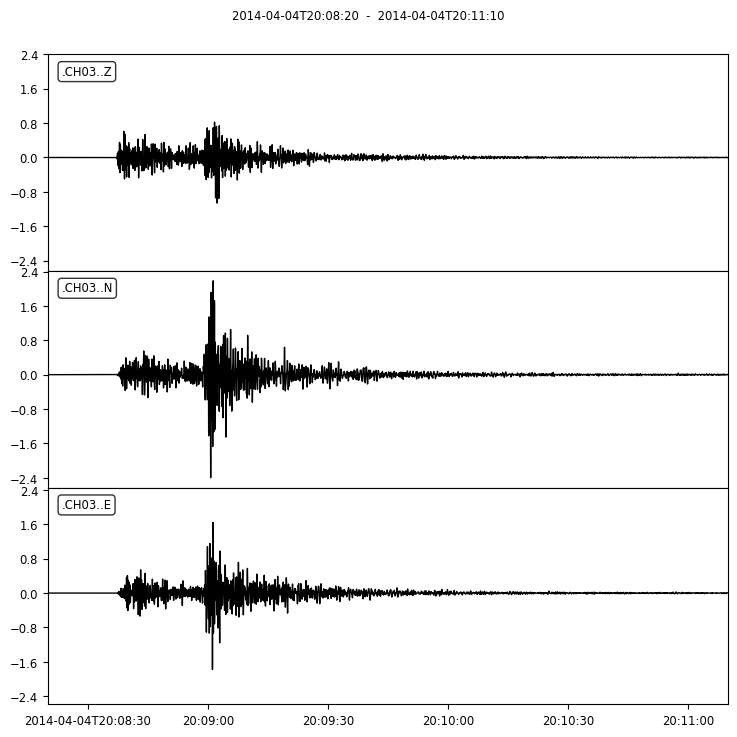
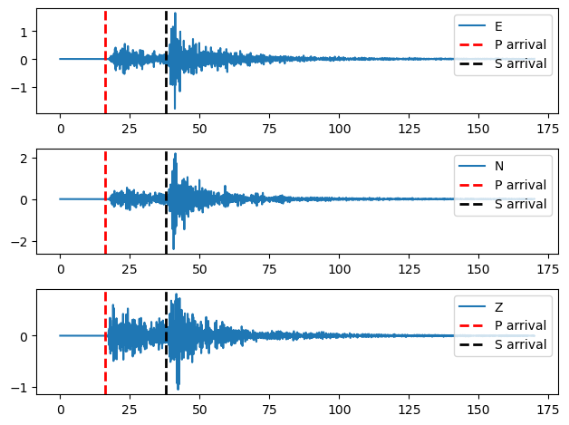
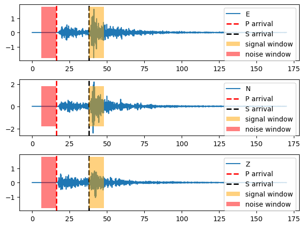
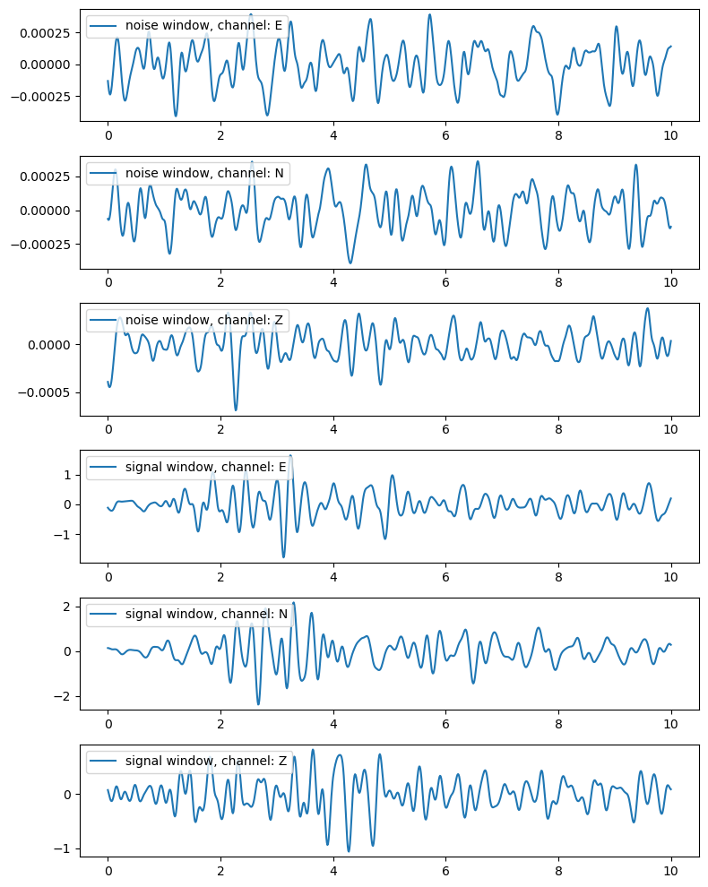
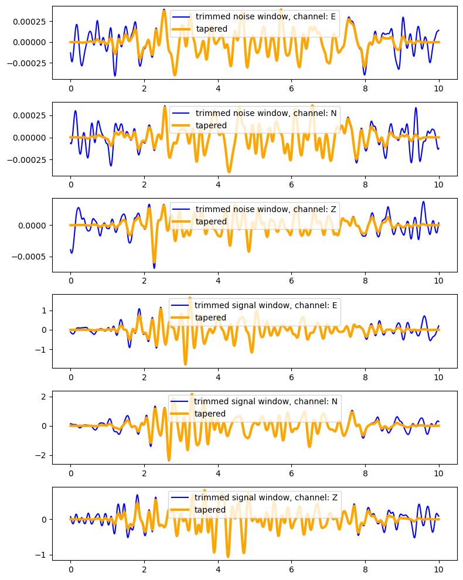
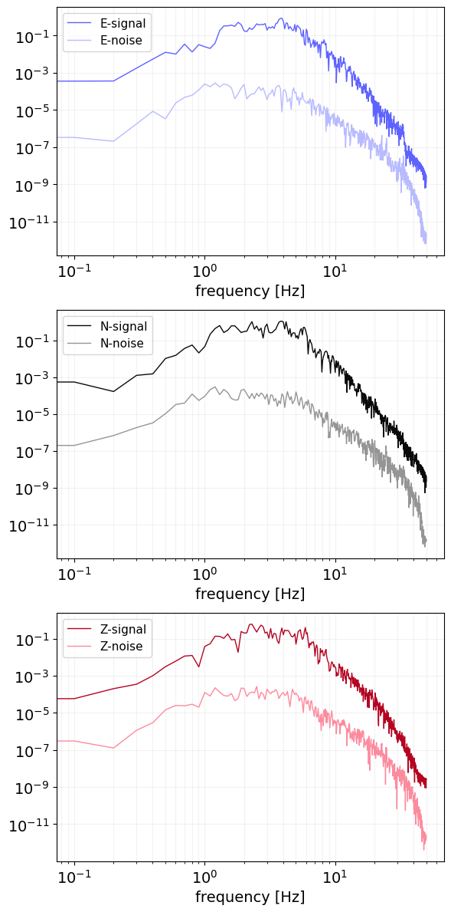

## Task Description

In this tutorial, our aim is to compute the Fourier spectra within the signal and the noise windows on the waveforms. This process involves a series of crucial pre-processing steps which enhance the quality of the data and ensure that the subsequent Fourier spectra analysis is applied at a specific portion of the seismic recordings. The pre-processing steps can be summarized as follows:

- Apply a bandpass filter (1 to 3 Hz) to eliminate unwanted noise from the seismic signal, ensuring that only the relevant frequency band is retained for further analysis.
- Select the P & S wave arrival times to define the edges of the signal and the noise windows later.
- Set the window edges according to the selected arrivals (signal window: from S arrival to S arrival plus window length, noise window: P arrival minus window length to P arrival).
- Cut the waveforms into signal and noise windows. Both windows will have a consistent duration (window length) of 10 seconds.
- Apply a smoothing algorithm (tapering) on the waveforms in order to ensure zero acceleration values at the edges.
- Compute the fourier spectra on the processed waveforms

## Getting data

In this article we will make use of the [ObsPy Python library](https://docs.obspy.org/) to apply the seismological computations and the [Python Matplotlib library](https://matplotlib.org/) to plot the results. For this reason, we will start by initializing the libraries that we will use throughout the rest of the article:

```py
    import matplotlib.pyplot as plt
    from obspy.core import read, UTCDateTime
    import numpy as np
```

To proceed, start by reading a seismic file which has a [MiniSEED](https://ds.iris.edu/ds/nodes/dmc/data/formats/miniseed/) file format:

```py
    st = read("20150724_095849_KRL1.mseed")
    print(st)
```

```text
    3 Trace(s) in Stream:
    .KRL1..E | 2015-07-24T09:58:49.000000Z - 2015-07-24T10:01:39.000000Z | 100.0 Hz, 17001 samples
    .KRL1..N | 2015-07-24T09:58:49.000000Z - 2015-07-24T10:01:39.000000Z | 100.0 Hz, 17001 samples
    .KRL1..Z | 2015-07-24T09:58:49.000000Z - 2015-07-24T10:01:39.000000Z | 100.0 Hz, 17001 samples
```

To illustrate the waveforms, we will use the `plot()` method of the `Stream` object:

```py
    # plot the recordings
    st.plot()
```

## Application of the pre-processing steps

### Applying a bandpass filter

Initiate the process by applying a bandpass filter to the records within the frequency range of 1 to 3 Hz. This step aims to eliminate surrounding noise and facilitate the arrival selection. Utilize the ObsPy `filter()` function for this purpose:

```py
    # apply an inplace bandpass filter of 1-3 Hz
    st.filter('bandpass', freqmin=1, freqmax=5)

    # plot the recordings
    st.plot()
```


_Recordings after applying a 1-3 Hz bandpass filter, showing time (x-axis) and acceleration (y-axis) for three components._

### Selection of the P and S wave arrivals

It's clear from the vertical filtered component (Z), that the P wave arrival occurs roughly at 09:59:03 and the S wave arrival at 09:59:21. Convert these into ObsPy [`UTCDateTime`](https://docs.obspy.org/packages/autogen/obspy.core.utcdatetime.UTCDateTime.html) objects and convert the arrival values as total seconds from the starting date:

```py
    # Define the P and S wave arrivals as UTCDateTime objects
    Parr = UTCDateTime('2015-07-24 09:59:03')
    Sarr = UTCDateTime('2015-07-24 09:59:21')

    # get the first trace
    first_trace = st.traces[0]

    # Get the starting date of the records from the first trace of the stream object
    start_date = first_trace.stats.starttime

    # Get the arrivals in seconds from the start date
    Parr_sec = Parr - start_date
    Sarr_sec = Sarr - start_date
```

To plot the P-wave and S-wave arrivals on the waveforms, we use Matplotlib's [`axvline()`](https://matplotlib.org/stable/api/_as_gen/matplotlib.pyplot.axvline.html) function, to mark these time points with vertical lines. Here's an example of how you can do it in Python:

```py
    # Initialize a matplotlib figure and axes with the total
    # number of plots equal to the number of traces len(st)
    fig, ax = plt.subplots(len(st), 1)

    # Loop through all the traces in the stream object (st)
    for n, tr in enumerate(st):
        # get the time series time information of the current trace
        xdata = tr.times()

        # get the acceleration data of the current trace
        ydata = tr.data

        # plot the graph with legend, the trace component or channel
        ax[n].plot(xdata, ydata, label=tr.stats.channel, lw=1)

        # add two vertical lines that represent the arrivals
        ax[n].axvline(x=Parr_sec, ymin=0, ymax=1, lw=2, ls='--', color='red', label='P arrival')
        ax[n].axvline(x=Sarr_sec, ymin=0, ymax=1, lw=2, ls='--', color='black', label='S arrival')

        # add the legend on the plot
        ax[n].legend(loc='upper right')

    # adjust the subplots so they do not overlap
    plt.tight_layout()
```


_Arrivals of the P (red dashed line) and the S (black dashed line) waves represented by two vertical lines_

### Initializing the signal and noise windows

At this stage we draw two windows using Matplotlib's [`fill_betweenx()`](https://matplotlib.org/stable/api/_as_gen/matplotlib.pyplot.fill_betweenx.html) function. We utilize these windows, to calculate the Fourier Spectra, for the signal part of the waveform and for the noise part. Both windows will share the same duration or length of 10 seconds. The first window will start from the S wave arrival and it will end 10 seconds later and the second one (noise) will begin 10 seconds before the P wave arrival and it will end at the P arrival. Let's illustrate these windows:

```py
    # set the window length
    window_length = 10

    # Initialize a matplotlib figure and axes with the total
    # number of plots equal to the number of traces len(st)
    fig, ax = plt.subplots(len(st), 1)

    # Loop through all the traces in the stream object (st)
    for n, tr in enumerate(st):
        # get the time series time information of the current trace
        xdata = tr.times()

        # get the acceleration data of the current trace
        ydata = tr.data

        # plot the graph with legend, the trace component or channel
        ax[n].plot(xdata, ydata, label=tr.stats.channel)

        # add two vertical lines that represent the arrivals
        ax[n].axvline(x=Parr_sec, ymin=0, ymax=1, lw=2, ls='--', color='red', label='P arrival')
        ax[n].axvline(x=Sarr_sec, ymin=0, ymax=1, lw=2, ls='--', color='black', label='S arrival')

        # get the min and max acceleration values
        min_y_value = tr.data.min()
        max_y_value = tr.data.max()

        # create the signal and the noise window on the waveforms
        ax[n].fill_betweenx([min_y_value,max_y_value], x1=Sarr_sec, x2=Sarr_sec+window_length, alpha=0.5, facecolor='orange', zorder=2, label='signal window')
        ax[n].fill_betweenx([min_y_value,max_y_value], x1=Parr_sec-window_length, x2=Parr_sec, alpha=0.5, facecolor='red', zorder=2, label='noise window')


        # add the legend on the plot
        ax[n].legend(loc='upper right')

    # adjust the subplots so they do not overlap
    plt.tight_layout()
```


_Define the signal and the noise windows to calculate the Fourier Spectra. Both will have the same duration of 10 seconds. The signal window starts at the S wave arrival and ends 10 seconds later. Similarly, the noise window initiates 10 seconds prior the P wave arrival and ends at the P wave arrival._

### Trimming the waveforms

To continue, we trim the waveforms between the previously defined, windows using the ObsPy [`trim()`](https://docs.obspy.org/packages/autogen/obspy.core.stream.Stream.trim.html) function. Because the trimming happens inplace, create copies of the orginal stream using the [`copy()`](https://docs.obspy.org/packages/autogen/obspy.core.stream.Stream.copy.html) method:

```py
    # noise window: from Parr-window_length to Parr
    # signal window: from Sarr to Sarr+window_length
    # Trim the stream at the two windows
    st_signal = st.copy().trim(starttime=start_date+Sarr_sec, endtime=start_date+Sarr_sec+window_length)
    st_noise = st.copy().trim(starttime=start_date+Parr_sec-window_length, endtime=start_date+Parr_sec)
```

Then plot the trimmed waveforms for each window and for each component (3 components for the signal part and 3 for the noise part):

```py
    # Initialize a matplotlib figure and set the total number of rows equal to
    # the number of traces plus 3 (3 signal components and 3 noise components)
    fig, ax = plt.subplots(len(st)+3, 1, figsize=(8,10))

    # Loop through all the traces in the noise Stream
    # and plot them in the first 3 plots of the figure
    for n, tr_noise in enumerate(st_noise):
        # get the time series time information as seconds from the starting date
        xdata = tr_noise.times()

        # get the acceleration data of the current trace
        ydata = tr_noise.data

        # plot the graph
        ax[n].plot(xdata, ydata, label=f'noise window, channel: {tr_noise.stats.channel}')

        # add the legend
        ax[n].legend(loc='upper left')

    # Loop through all the traces in the signal Stream
    # and plot them in the next 3 plots of the figure
    for n, tr_signal in enumerate(st_signal, start=3):
        # get the time series time information as seconds from the starting date
        xdata = tr_signal.times()

        # get the acceleration data of the current trace
        ydata = tr_signal.data

        # plot the graph
        ax[n].plot(xdata, ydata, label=f'signal window, channel: {tr_signal.stats.channel}')

        # add the legend
        ax[n].legend(loc='upper left')

    # adjust the subplots so they do not overlap
    plt.tight_layout()
```


_Trimmed waveforms at the two windows (signal, noise), for each component (E, N, Z)_

### Applying a smoothing algorithm

At the last step, generate another copy of two obects from the previous trimmed recordings and smooth the left and the right side of the waveforms, using the obspy [`taper()`](https://docs.obspy.org/packages/autogen/obspy.core.trace.Trace.taper.html) function:

```py
    # taper the waveforms at the respective windows 30% on the left and 30% on the right side
    # again use the copy() function to apply the taper on new stream object
    st_signal_taper = st_signal.copy().taper(side='both', max_percentage=0.3)
    st_noise_taper = st_noise.copy().taper(side='both', max_percentage=0.3)
```

Lastly, show the results:

```py
    # Initialize a matplotlib figure and axes with the total  number of rows equal to
    # the number of traces plus 3 (3 signal traces and 3 noise traces)
    fig, ax = plt.subplots(len(st)+3, 1, figsize=(8,10))

    # Loop through the number of traces in the noise Stream object
    for i in range(len(st_noise)):
        # plot the trimmed waveforms with blue color
        ax[i].plot(st_noise[i].times(), st_noise[i].data, label=f'trimmed noise window, channel: {st_noise[i].stats.channel}', color="blue")

        # plot the tapered waveforms with orange color
        ax[i].plot(st_noise_taper[i].times(), st_noise_taper[i].data, label='tapered', lw=3, color="orange")

        # add the legend
        ax[i].legend(loc='upper center')

    # Loop through the number of traces in the signal Stream object
    for i in range(len(st_signal)):
        # plot the trimmed waveforms with blue color
        ax[i+3].plot(st_signal[i].times(), st_signal[i].data, label=f'trimmed signal window, channel: {st_signal[i].stats.channel}', color="blue")

        # plot the tapered waveforms with orange color
        ax[i+3].plot(st_signal_taper[i].times(), st_signal_taper[i].data, label='tapered', lw=3, color="orange")

        # add the legend
        ax[i+3].legend(loc='upper center')

    # adjust the subplots so they do not overlap
    plt.tight_layout()
```


_Trimmed (blue) and tappered (orange) waveforms at the noise and the signal window for all the components_

### Computation of the fourier spectra

Finally, we can calculate the Fourier Spectra at the noise and the signal window:

```py
    # get the first trace of the signal Stream object
    first_trace = st_signal_taper.traces[0]

    # get the starting date of the recordings
    starttime = first_trace.stats.starttime

    # get the sampling frequency and the sample distance
    fs = first_trace.stats["sampling_rate"]
    delta = first_trace.stats["delta"]

    # calculate the nyquist frequency
    fnyq = fs / 2

    # initialize a dictionary to save the outputs
    fourier_data_dict = {}

    # loop through the traces
    for i in range(len(st_signal_taper)):
        # get a copy of the trace for the singal
        df_s = st_signal_taper[i].copy()

        # get the current trace channel
        channel = df_s.stats.channel

        # get the number of sample points after the trimming
        npts = df_s.stats["npts"]

        # calculate the number of frequencies on the frequency spectra
        sl = int(npts / 2)

        # calculate the frequnecy array to plot the fourier
        freq_x = np.linspace(0 , fnyq , sl)

        # save the frequencies in a variable to use it later at the plotting
        xdata = freq_x

        # compute the fft of the signal
        yf_s = np.fft.fft(df_s.data[:npts])
        y_write_s = delta * np.abs(yf_s)[0:sl]

        # do the same also for the noise part
        # get a copy of the trace for the noise
        df_p = st_noise_taper[i].copy()

        # calculate the fft
        yf_p = np.fft.fft(df_p.data[:npts])
        y_write_p = delta * np.abs(yf_p)[0:sl]

        # add the fft of the signal and noise part to the dictionary for the current trace
        fourier_data_dict[channel] = {"signal": y_write_s, "noise": y_write_p}
```

And we present the results:

```py
    # initialize a Matplotlib figure to plot the Fourier data
    figfourier, axfourier = plt.subplots(1, len(fourier_data_dict),  figsize=(19,6))

    # create a hex colors list to style the curves
    colors = ['#5E62FF', '#B9BBFF', '#0a0a0a', '#969595', '#b50421', '#fc8b9e']

    color_i = 0
    # loop through each component at the dictionary
    for n, compo in enumerate(fourier_data_dict):
        # loop through the 'noise' and the 'signal' part
        for s_n in fourier_data_dict[compo]:
            # define the ydata with data located in the dictionary created earlier
            ydata = fourier_data_dict[compo][s_n]

            # create a variable to save the legend name of the curves
            label_name = f"{compo}-{s_n}"

            # plot the frequencies and the data
            axfourier[n].plot(xdata, ydata, color=colors[color_i], lw=1, label=label_name)
            color_i += 1

        # style the graphs
        axfourier[n].legend(loc='upper left', fontsize=11, facecolor='w')
        axfourier[n].set_xscale('log')
        axfourier[n].set_yscale('log')
        axfourier[n].set_xlabel("frequency [Hz]", fontsize=14)
        axfourier[n].grid(color='grey', ls='-', which='both', alpha=0.1)
        axfourier[n].tick_params(axis='both', which='both', labelsize=14)

    plt.tight_layout()
```


_Fourier Spectra of the signal (bold curve) and the noise (muted curve) window for each component of the tappered Stream object_
