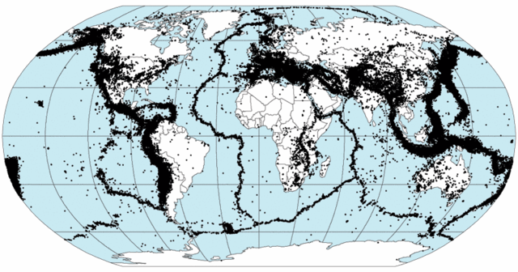
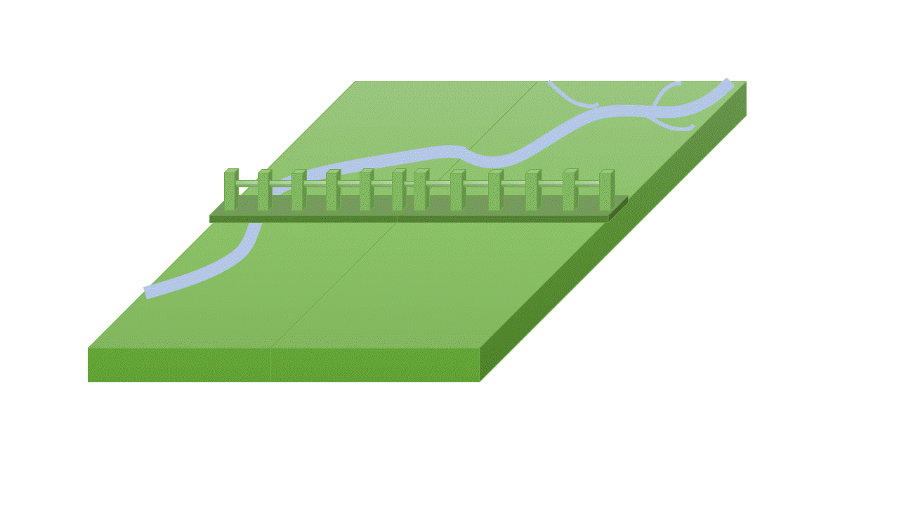
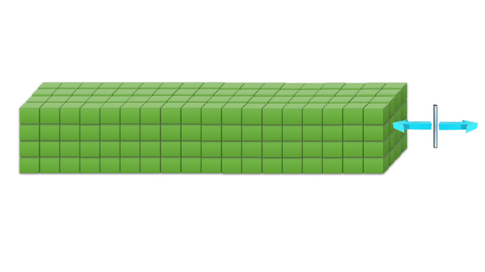
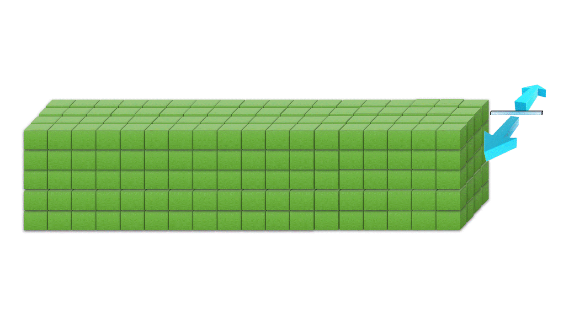
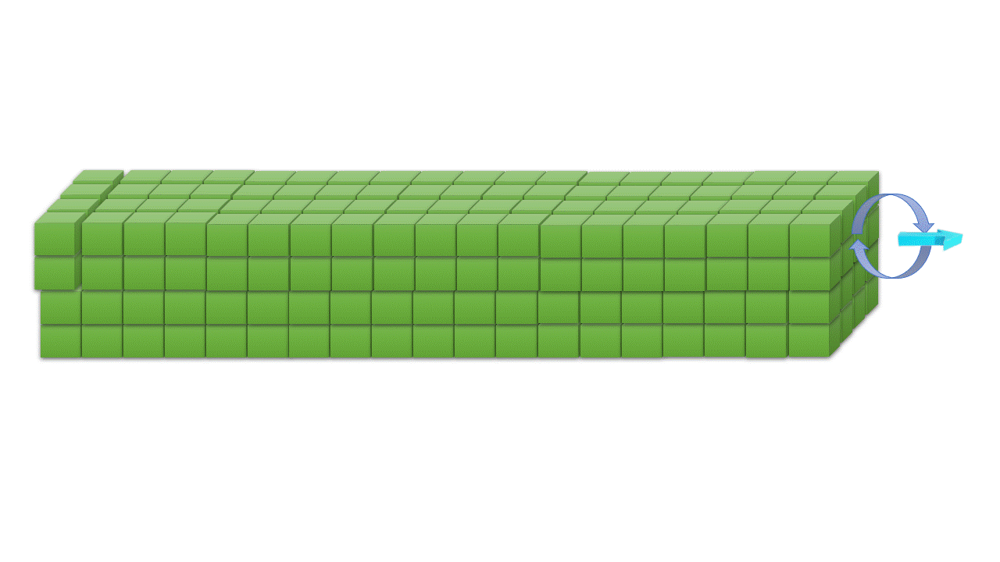
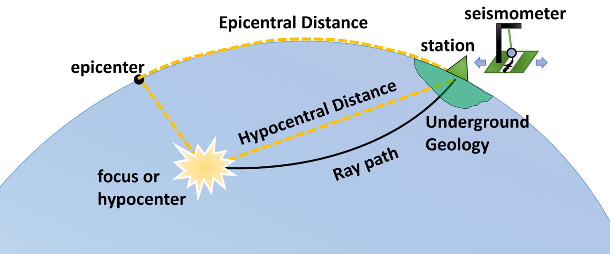
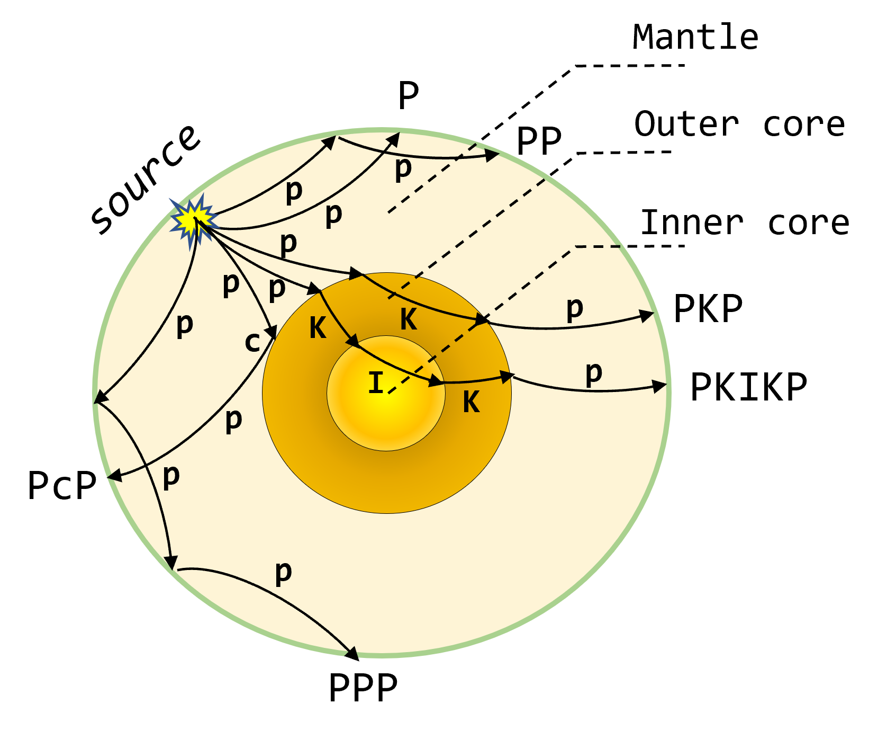
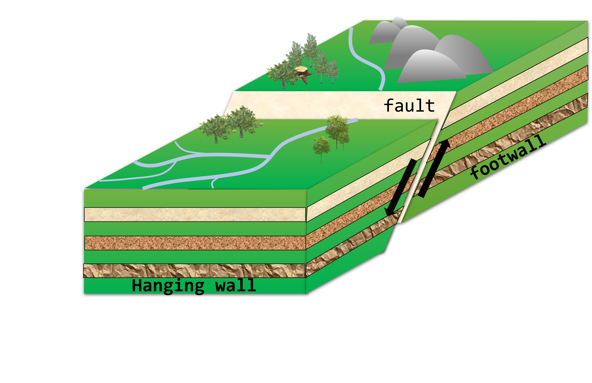
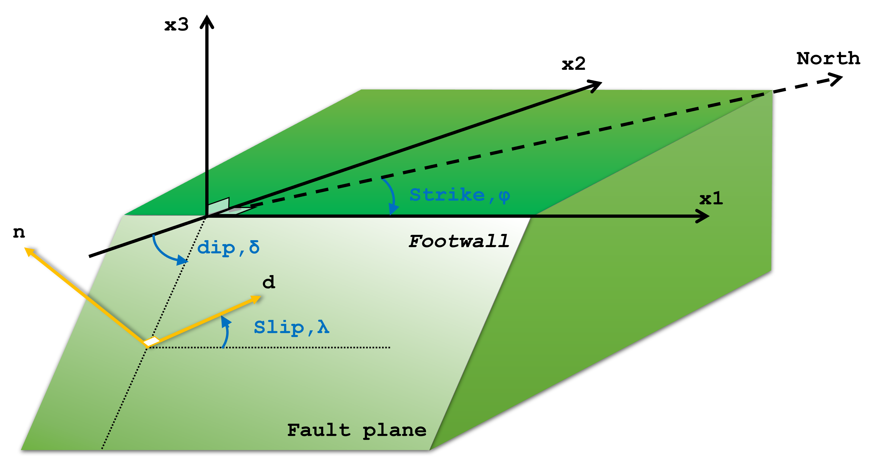

## What is an Earthquake?

An earthquake is a natural phenomenon that occurs when there is a sudden release of energy in the Earth's crust, resulting in seismic waves that cause the ground to shake. This shaking can range from minor tremors that are barely noticeable to violent movements that can cause widespread destructions. Earthquakes can be generated in various ways such as along the edges of the tectonic plates that constitute the earth, along seismic faults far from the edges of the tectonic plates (intraplate earthquakes), volcanic activity, human activity (induced seismicity) etc.

Tectonic plates are part of the lithosphere of the Earth. They are in constant motion between one another due to the heat-driven convection currents in the Earth's mantle. When the edges of these plates interact, they can grind against each other, pull apart, or collide. The stress and pressure that build up at these plate boundaries can be released suddenly and create an earthquake. The largest earthquakes typically occur at plate boundaries.

_Most earthquakes are concentrated at the edges of the tectonic plates that consitute the lithosphere of the Earth_

Earthquakes can also originate from the sudden movement along active faults within a single tectonic plate. Active faults are fractures in the Earth's crust that have experienced recent movement, and they can accumulate stress over time. When the stress along these faults becomes too great, the rocks can slip suddenly, generating seismic waves and causing an earthquake.

_Generation of an earthquake by a sudden release of enery of an active seismic fault_

Earthquakes can have a wide range of effects, including ground shaking, surface rupture, landslides, tsunamis (if the earthquake occurs under the ocean), and damage to buildings and infrastructure. The severity of an earthquake's impact depends on its magnitude (energy released), its distance from the epicenter, and local geological conditions.

## Seismic Waves

The released energy travels through the earth material in the form of seismic waves. These waves carry valuable information about the Earth's interior structure and composition. Seismic waves can be mainly categorized into two types of waves: body waves and surface waves.

### Body Waves

Body waves are a type of seismic waves that travel through the Earth's interior layers. There are two main types of body waves: P-waves (primary or compressional waves) and S-waves (secondary or shear waves).

Compressional or P waves are the fastest seismic waves and are the first to be detected at a seismic station after an earthquake event. They travel through solid and liquid materials. It's wave motion causes the particles in the rock to move in the same direction as the one that the wave is propagating. This movement is in the form of compression and expansion like a spring.

_Propagation of P waves_

On the other hand, shear waves are another type of body waves which are slower that the P waves, and they arrive at a later time at the seismic station. They can only pass through solid materials, due to its wave motion that cause particles in the rock to move perpendicular to the direction of wave propagation. This movement is in a side-to-side or up-and-down motion, resembling the movement of a rope. S-waves are responsible for the most severe shaking and structural damage after an earthuake. Due to its motion the S waves can be further classified to SH or horizontal shear and SV or vertical shear waves. The SH waves have a horizontal shearing motion, causing particles to move side-to-side in a horizontal direction. This side-to-side motion is similar to the movement of a snake. The SV waves have a vertical shearing motion, causing particles to move up and down in a vertical direction.

_Propagation of SH waves_

_Propagation of SV waves_

### Surface Waves

Surface waves are another type of seismic waves that travel along the Earth's surface rather than propagating through its interior. These waves are produced by the complex interactions of compressional (P) and shear (S) waves with the Earth's surface. Surface waves have a distinct motion that is similar to the movement of ocean waves. They move slower than P-waves and S-waves but can have larger amplitudes, making them particularly impactful during earthquakes. Surface waves are responsible for much of the ground shaking and damage experienced in seismic events. There are two main types of surface waves: Love waves, which have a side-to-side motion resembling a snake's slither, and Rayleigh waves, which produce an elliptical, rolling motion.

_Propagation of Love Waves_

_Propagation of Rayleigh Waves_

## Earthquake concepts

Seismic waves are generated at a source called focus or hypocenter, which can be natural, such as an earthquake or artificial, such as an explosion. The generated waves travel through the earth medium and are recorded at a receiver. The receiver is known as the seismometer and the record of the ground motion at the seismometer is called the seismogram. A seismogram, contains information about both the source and the medium. The earth medium, or subsurface, refers to the material through which seismic waves travel, which can include rock layers, soil, and fluids.

If the origin time when the waves left the source is known, their arrival time at the receiver gives the travel time required to pass through the medium. This time gives information about the speed at which they traveled and generally about the physical properties of the medium. In addition because the amplitude of the waves are affected by the medium, the signals observed on seismograms provide additional information about the portion of the earth that the waves traveled through.

_Seismic waves are generated at a source or focus, travel through the earth medium and are recorded at a receiver or seismometer at the surface._

The seismic waves can be highly affected by the underground geology, a phenomenon known as site effect. The underground structure can greatly amplify or deamplify the amplitude of the incoming ground motion as well as change its frequency content.

The distance between the source and the station that recorded the earthquake is known as Hypocentral Distance. It provides information about the direct path that seismic waves take to reach an observation point. On the other hand, Epicentral Distance is the distance from the epicenter, which is the point directly above the hypocenter on the Earth's surface, to the station. These distances are essential in assessing the intensity and impact of seismic events, aiding in understanding their effects on structures and communities.

## Seismic phases

In addition to the direct P and S waves, there are other related waves that arise from the interactions of the seismic waves with the various layers and boundaries within the Earth. These phases play a crucial role in unraveling the Earth's intricate internal structure. For instance, there is a phase of the compressional (P) wave that can occur after it reflects the surface and then is recorded at the receiver (PP). Another, happens when then P wave reflects the outer core and then end up at the receiver (PcP) or when the P wave travels through the mantle, the outer and the inner core and then ends up at the surface (PKIKP). Similar seismic phases can be generated from the direct shear (S) waves and its interactions with the underground layers.

_Various seismic phases generated from the interactions of the body waves and the earth's interior layers_

Seismologists use these seismic phases to uncover the secrets of Earth's deep layers. By studying when and how these phases arrive, scientists explore the mysteries of our planet's hidden geology, enhancing our understanding of Earth's complexity and dynamics.

## Seismic Faults

Earthquakes almost always happen along faults, where one part of the Earth's surface shifts relative to the other. These faults are often recognized through geological mapping, revealing historical fault movements. As per the elastic rebound theory, stress builds up on opposite sides of the fault, effectively locking it. When the accumulated strain overcomes the fault's strength, it suddenly releases, causing the fault to slip and triggering an earthquake. The upper or overlying block along the fault plane (assuming that a fault is a planar surface) is called the hanging wall and the block that lies underneath is called the footwall.

_A fault is assumed to be a planar surface. The block located above the fault plane is called the hanging wall and the block below, the footwall_

To describe the geometry of a fault, we need to assume that a fault is a planar surface across which relative motion accurs during an earthquake. The coordinate axis used to describe the fault are the X1 axis that is called the strike of the fault (the instersection of the fault plane with the surface), the X2 axis that is perpedicular to the X1 axis and X3 axis that it points upward and is perpendicular to the other two.

_The geometry of a seismic fault_

The fault geometry can be completely described using two different coordinate systems: a) n, d and b) φ, δ, λ. The first coordinate system uses the normal vector on the fault plane (n) and the perpendicular to the normal vector, the slip vector, d that shows the direction of motion, that is the direction in which the upper side of the fault (hanging wall) moved with respect to the lower side (foot wall). The second system, consists of the dip angle δ, that gives the orientation of the fault plane with respect to the surface, the counterclockwise measured slip angle λ measured from the X1 axis, that gives the direction of motion or the motion of the hanging wall block with respect to the foot wall block and lastly the fault strike φ that is the angle measured clockwise from the North to the X1 axis.

Due to different values of the slip angle (0-360 degrees) we can classify the faults into three categories: a) normal faulting, b) reverse or thrust faulting, c) strike-slip faulting. However, most earthquakes consists of some combination of these motions and have slip angles between these values.

### Normal-slip faulting

This describes a dip-slip motion. In this position, the hanging wall moves downwards relative to the foot wall, indicating normal fault activity. In this case, the slip angle is 270 degrees.
Normal slip faulting. The hanging wall moves downwards relative to the foot wall in which the slip angle is 270 degrees

_Normal slip faulting. The hanging wall moves downwards relative to the foot wall in which the slip angle is 270 degrees_

This also describes a dip-slip motion. In this position, the hanging wall moves upwards relative to the foot wall, indicating reverse fault activity. The slip angle is 90 degrees.
Reverse slip faulting. The hanging wall moves upwards relative to the foot wall in which the slip angle is 90 degrees

_Reverse slip faulting. The hanging wall moves upwards relative to the foot wall in which the slip angle is 90 degrees_

When the two sides of the fault slide horizontally by each other, a pure strike-slip occurs. Depending on the direction of movement when viewed from one side of the fault, the slip can be described as left-lateral or right-lateral. When the slip angle is zero, the hanging wall moves to the right and the motion is left-lateral. Similarly, for slip angle at 180 degrees, a right-lateral motion occurs.

_Left-lateral strike-slip fault. This movement results in a 0-degree slip angle, as the relative motion is in the opposite direction when compared to the reference point on the other side of the fault_

## Seismic Hazards

One of the most significant seismic hazards is the shaking of the ground. When an earthquake happens, waves spread out from the source and move quickly through the Earth's outer layer. When these waves reach the surface, they cause the ground to shake, which can last a few seconds or even minutes. Most of the problems caused by earthquakes come from this shaking. If there's not much shaking, the other issues related to earthquakes might not be a big concern. But when the shaking is powerful, it can lead to various problems like landslides or collapsing buildings.

Undoubtedly, the most striking and unforgettable depictions of earthquake devastation are the structural hazards. From the anticipated collapse of poorly fortified masonry and adobe buildings, where numerous individuals in less developed regions reside, to the unexpected ruination of more contemporary constructions, structural impairment remains a primary factor contributing to both loss of life and financial setbacks in numerous seismic events.

Some of the most remarkable instances of earthquake-related destruction have taken place when soil deposits lose their solidity and seem to transform into fluid-like substances. This occurrence, known as liquefaction, entails a significant reduction in the soil's strength, often to the extent that it's incapable of providing support to structures or retaining stability. Liquefaction is primarily observed in saturated soils, making it most prevalent in close proximity to rivers, bays, and other water bodies.

Powerful earthquakes frequently trigger landslides. While most of these landslides are minor in scale, seismic events have also led to substantial slides. Regrettably, in certain instances, landslides triggered by earthquakes have completely covered towns and villages. More frequently, earthquake-triggered landslides cause harm by demolishing structures or disrupting bridges and other constructed structures.

The rapid vertical movements of the seafloor due to fault ruptures during earthquakes can result in the formation of tsunamis, which are lengthy sea waves with extended periods. When in the open ocean, tsunamis cover vast distances at significant speeds, yet they are challenging to detect. Their usual height remains under 1 meter, while their wavelengths can span several hundred kilometers. However, as a tsunami nears the coastline, the reduction in water depth causes its speed to decrease and the wave's height to increase. In specific coastal regions, the seabed's configuration might amplify the wave, giving rise to an almost perpendicular wall of water that surges far inland, causing catastrophic devastation. When earthquakes generate waves in enclosed water bodies, these are referred to as seiches. Typically brought about by seismic waves with long periods that match the natural oscillation period of water within a lake or reservoir, seiches can manifest over extensive distances from the earthquake's source.
